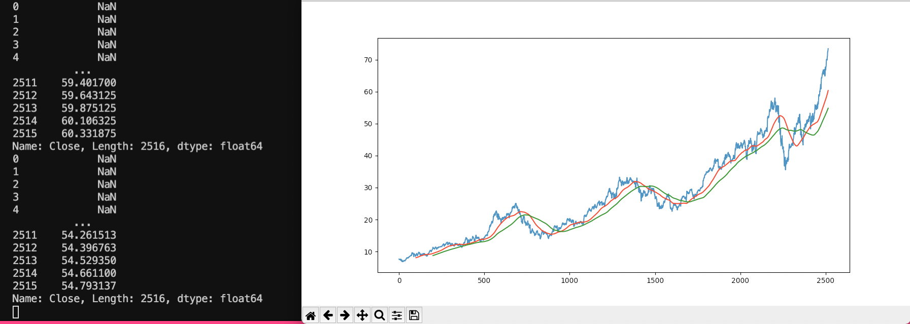
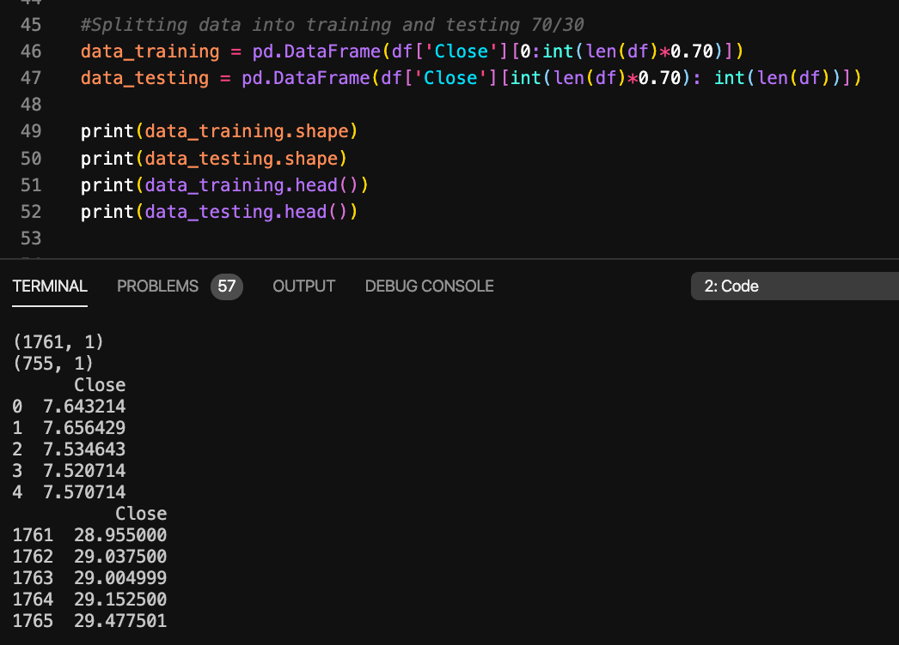
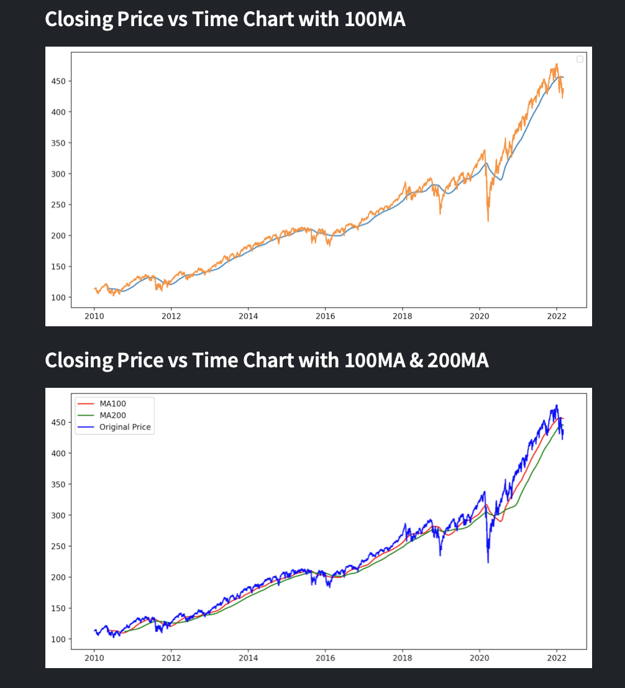

# A Stock Trend Prediction Web Application in Python. Here we will use Streamlit, an open-source Python library, that makes it easy to build custom web apps for Machine Learning and Data Science.

# Step By Step Terminal Testing Output

### Testing Retrieval Of Data

### Testing Plotting Data

### Testing Plotting Our Moving Average 100
#### Notice how 'NaN appears for the first 100 rows, this is because we used a 100 day MA

### Testing Plotting Our Moving Average's
#### Red is our 100MA and Green is our 200MA

### Splitting our Data 70/30, 70 for training 30 for testing

### Summary of our Machine Learning Model

### Predicting our values and plotting them

### Demo for our Web app, showcasing the user input data display along with the data and time chart

### Demo for our Web app, showcasing the 100MA and 200MA

### Demo for our Web app, showcasing the future predictions

